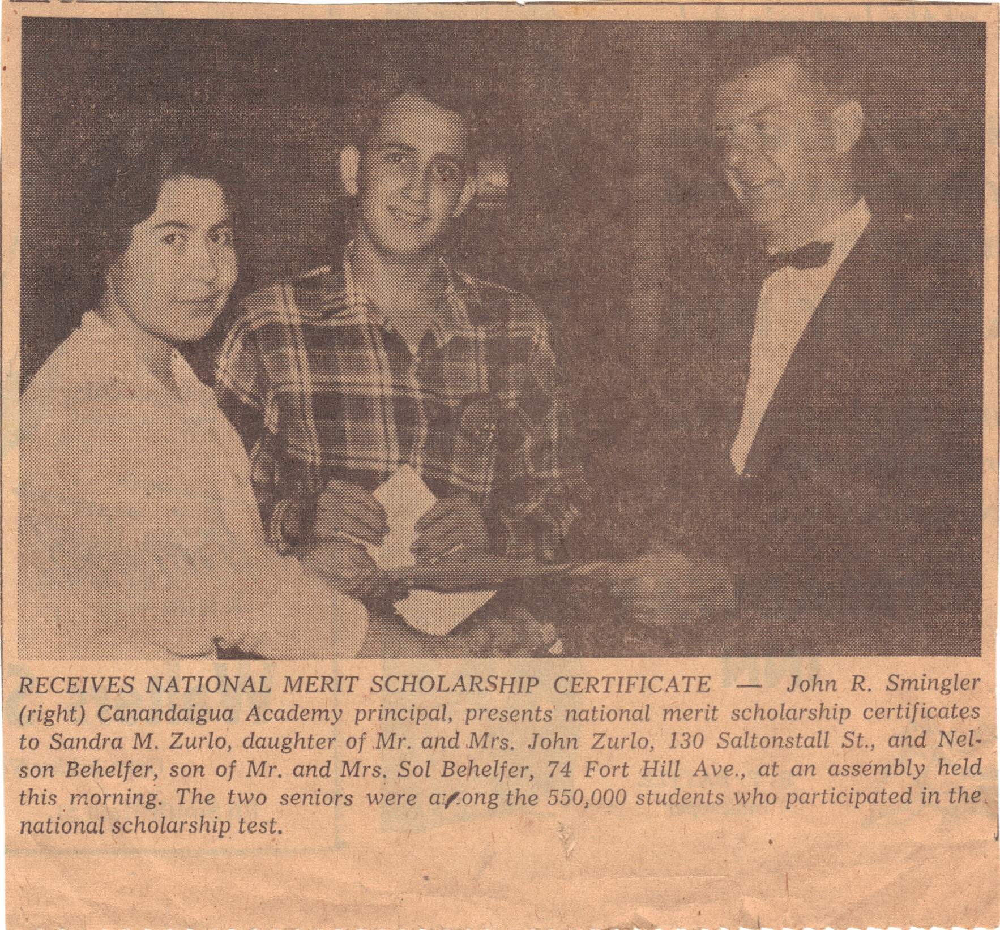

##Childhood

Neil Rogers (Nelson Roger Behelfer) was born at Strong Memorial Hospital in Rochester, New York on November 5, 1942.

Neil's first childhood home was on Ok Terrace in Rochester. He attended Brighton Elementary School. He later moved to 74 Fort Hill Ave in Canandaigua New York. Neil won a National Merit Scholarship at Canandaigua Academy in 1959.

